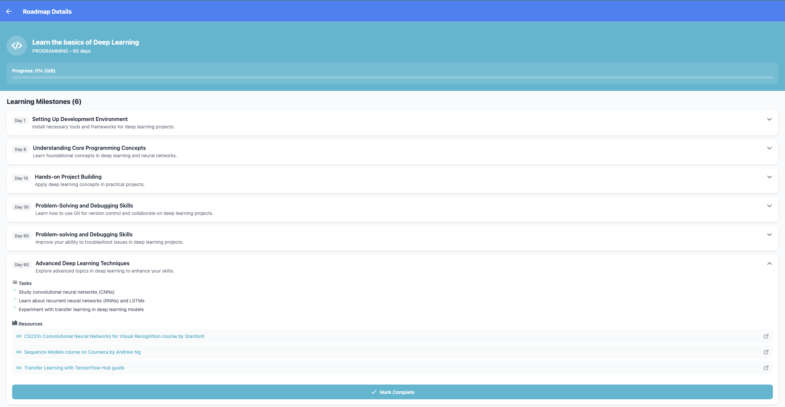

# Wayfound [WIP]
AI-powered personalized learning roadmaps for any skill you want to master

Wayfound is a full-stack application that uses AI to create customized learning paths based on your goals, skill level, available time, and learning preferences. Whether you want to learn cooking, programming, fitness, languages, or any other skill, Wayfound generates a structured roadmap with milestones, tasks, and curated resources.

---

## Current Features
- **AI-Powered Roadmap Generation**:
  - Uses OpenAI GPT to create personalized learning plans
- **Smart Survey System**:
  - Adapts questions based on your learning goal
- **Progress Tracking**:
  - Visual milestone completion with progress indicators
- **Curated Resources**:
  - Specific YouTube channels, books, courses, and tools for each milestone
- **Domain Intelligence**:
  - Specialized roadmaps for cooking, fitness, programming, languages, art, and more
- **Flexible Timelines**:
  - Roadmaps adapt to your available time (15 minutes to 2+ hours daily)
- **Cross-Platform**:
  - React Native app works on iOS, Android, and web
---

## How it Works? (Video demo coming soon)
1. **Set Your Goal** by telling Wayfound what you want to learn, then continue to personalization

2. **Take the Survey:** Answer questions about your skill level, available time, and learning style

3. **Get Your Roadmap**: AI generates a personalized plan with:
  - Day-by-day milestones
  - Specific tasks for each milestone
  - Curated resources (YouTube channels, books, tools, websites) 
  - Progress tracking

4. **Follow and Learn:** Complete milestones and track your progress

---

## Tech Stack
### Backend

**FastAPI** as the web framework
**Strawberry GraphQL** as the GraphQL API
**SQLAlchemy** as the DB ORM with PostgreSQL/SQLite
**OpenAI API** for the roadmap generation (still experimenting with other models)
**LangChain** for the AI I/O
**Docker** for containerization

### Frontend

**React Native** for cross-platform
**Expo** as dev platform
**Apollo Client** as GraphQL client
**TypeScript**

### Database
PostgreSQL (production) / SQLite (development)
Redis (optional caching)
